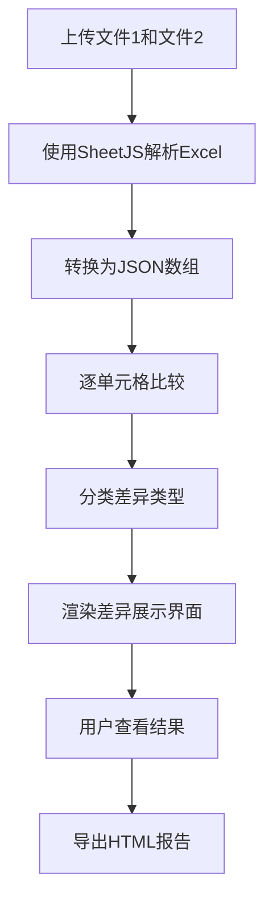

# ExcelDiff - Excel文件差异比较工具

## 1. 产品概述

一款优雅的在线Excel文件差异比较工具，帮助用户快速识别和对比两个Excel文件之间的内容差异。

### 主要目的
- 快速比较两个Excel文件的内容差异
- 高亮显示新增、删除和修改的数据
- 支持导出差异报告

### 目标用户
- 数据分析师
- 财务人员
- 项目经理
- 需要频繁比对Excel数据的办公人员

---

## 2. 核心功能

### 2.1 功能模块

1. **文件上传区**
   - 拖拽上传两个Excel文件
   - 点击选择文件上传
   - 显示已上传文件名称和大小

2. **差异比较引擎**
   - 支持 .xlsx 和 .xls 格式
   - 按工作表和单元格比较
   - 识别三种差异类型：新增（绿色）、删除（红色）、修改（黄色）

3. **差异展示区**
   - 双栏对比视图
   - 差异统计摘要
   - 点击差异项定位到具体位置

4. **导出功能**
   - 导出HTML格式的差异报告
   - 保留颜色高亮和格式

### 2.2 页面设计

| 页面 | 模块 | 功能描述 |
|------|------|----------|
| 主页面 | 文件上传区 | 双文件拖拽上传，支持点击选择 |
| 主页面 | 比较按钮 | 触发比较操作 |
| 主页面 | 差异展示区 | 显示比较结果，包含统计和详细列表 |
| 主页面 | 导出按钮 | 导出HTML差异报告 |

---

## 3. 核心流程

### 用户操作流程

```
1. 用户访问页面
      ↓
2. 上传第一个Excel文件
      ↓
3. 上传第二个Excel文件
      ↓
4. 点击"开始比较"按钮
      ↓
5. 系统解析两个文件并比较
      ↓
6. 显示差异结果（统计 + 详情）
      ↓
7. 用户可导出HTML报告
```

### 技术流程图



---

## 4. 用户界面设计

### 4.1 设计风格

**设计理念：精致简约 + 数据可视化**
- 采用现代扁平化设计，强调功能性和易用性
- 背景使用深色渐变，营造专业数据分析工具的氛围
- 使用高对比度颜色突出差异数据

**配色方案：**
- 主色：#6366F1（靛蓝色 - 代表专业和信任）
- 强调色：#22C55E（绿色 - 新增数据）
- 警示色：#EF4444（红色 - 删除数据）
- 提示色：#F59E0B（橙色 - 修改数据）
- 背景：#0F172A（深蓝黑色）
- 卡片背景：#1E293B（深灰蓝色）
- 文字：#F8FAFC（亮白色）/ #94A3B8（次级灰色）

**字体：**
- 标题：Poppins（现代几何感）
- 正文：Inter（清晰易读）

**布局：**
- 单页应用
- 卡片式布局
- 顶部标题区 + 主要操作区 + 结果展示区

### 4.2 交互效果

- 文件拖拽时的视觉反馈（边框高亮、缩放动画）
- 比较按钮的悬停和点击效果
- 差异列表项的悬停高亮
- 统计数字的计数动画
- 页面加载时的骨架屏效果

### 4.3 响应式设计

- 桌面优先设计
- 平板和移动端自适应布局
- 保持核心功能可用性

---

## 5. 技术实现要点

### 前端技术
- 纯前端实现，无需后端服务器
- 使用SheetJS库解析Excel文件
- 所有文件处理在浏览器本地完成，保护用户隐私

### 浏览器兼容性
- Chrome/Edge（推荐）
- Firefox
- Safari

### 性能考虑
- 文件大小限制：单文件建议不超过10MB
- 使用Web Workers处理大文件（可选优化）
